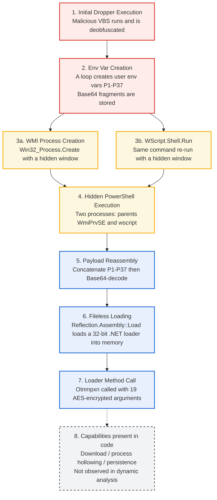

# .NET Loader Dropper Using WMI and Environment-Variable Fragmentation

> **English** | [한국어](README.md)
>
> **Notice:** This repository does **not** contain any malware samples (the original VBS, the reconstructed .NET payload, the embedded resource, etc.). Files are identified by hash (SHA-256) only. The analysis and IOCs are published for defensive and research purposes.

## 1. Executive Summary
* **Analysis dates:** Static analysis 2026-08-23 / Dynamic analysis and second-stage loader static analysis 2026-09-19
* **Analyst:** [poatanson / son]
* **Malware family:** Unconfirmed (multi-stage: VBScript dropper → .NET loader disguised as a legitimate library)
* **Summary:** This sample is a VBScript-based dropper. It uses WMI (`Win32_Process`) to launch PowerShell with a hidden window, and it also runs the same command through `WScript.Shell.Run`. The payload is fragmented into 37 user environment variables (`P1`–`P37`) that are created in a loop and hold Base64 pieces, which evades command-line length limits and signature-based detection. PowerShell concatenates and decodes the pieces into a 32-bit .NET assembly and loads it into memory (fileless) with `Reflection.Assembly::Load`. The loaded assembly is a loader disguised as the legitimate open-source library `Microsoft.Win32.TaskScheduler`. Its code contains downloader, process-hollowing, and persistence capabilities, but no follow-on activity was observed in the dynamic analysis environment. The final payload and its malware family could not be identified.

## 2. File Details
* **File name:** `c5103eaa70a4a80176440a0e0dc75136a0e7bcfd9a68d7c8440a4d0edea72011.vbs` (or the actual extension)
* **File size:** 40 MB (inflated with dummy code and Unicode emoji to hide the PowerShell command and hinder analysis)
* **Hashes:**
  * MD5: `f5b1c1919f175fce913df143accf44a3`
  * SHA-1: `8b3f6d2217b736d5bbe69de37a3dd95ee058151b`
  * SHA-256: `c5103eaa70a4a80176440a0e0dc75136a0e7bcfd9a68d7c8440a4d0edea72011`
* **File type:** VBScript

## 3. Analysis Environment
* **OS:** Windows 10 Pro 22H2 (VirtualBox, internal network with no internet access)
* **Main tools:** vbsedit, Sublime Text, LLM (to assist code deobfuscation), Sysmon, ILSpy, VirusTotal

## 4. Execution Flow



Steps 1–7 were confirmed by logs and static analysis. Step 8 (dotted) exists in the code, but its behavior was not confirmed in the dynamic analysis.

## 5. Technical Analysis

### 5.1. Environment-Variable Fragmentation and Stealthy WMI Execution
* **Environment variable creation:** The VBS creates the environment variables `P1`–`P37` in a loop and stores in each one a fragment of the Base64-encoded payload (a .NET assembly). They were confirmed as user-scope variables (section 6.4).
* WMI is used to avoid the window flicker and the command-line length limit of the usual `WScript.Shell.Run`.
* **Extracted WMI script:**
```vbscript
' ==========================================================
' [1] Initialize the WMI object and startup options
' ==========================================================
' Create the WMI root object (winmgmts:\\.\root\cimv2)
Set exophthalmy = GetObject(healthily)

' Create an instance of the Win32_ProcessStartup class
Set Acadia = exophthalmy.Get(healthilyt).SpawnInstance_

' Hide the window (0 = SW_HIDE)
Acadia.ShowWindow = 0

' Get the Win32_Process class object
Set wistit = exophthalmy.Get(echinocardium)


' ==========================================================
' [2] Process execution (contains redundant logic)
' ==========================================================
' [Attempt 1] Stealthy process creation through WMI
' Args: (command, current directory, startup options object, PID output variable)
lotus = wistit.Create(ballast, Null, Acadia, lithobiid)

' [Attempt 2] "Fallback" execution through WScript.Shell
' Args: (command, window style (0 = hidden), wait for completion (True))
opsonies.Run ballast, 0, True


' ==========================================================
' [Variable mapping summary]
' ==========================================================
' ballast   : powershell -ExecutionPolicy Bypass -WindowStyle Hidden -Command "$s=$env:P1+...+$env:P37; $b=[Convert]::FromBase64String($s); [Reflection.Assembly]::Load($b)|Out-Null; [OtnmpxnddVnptbN.mpxnddVn]::Otnmpxn('...')"
' healthily : "winmgmts:\\.\root\cimv2"
' healthilyt: "Win32_ProcessStartup"
' echinocardium: "Win32_Process"
```
* The code comment calls the second call a fallback, but in practice **both calls are executed** (section 6.2).

### 5.2. Second-Stage .NET Loader Static Analysis (ILSpy)

The file reconstructed from the environment-variable fragments (`payload.bin`) was analyzed statically with ILSpy and file parsing. No sample code was executed during this analysis.

| Item | Result |
|---|---|
| Assembly identity | `Microsoft.Win32.TaskScheduler` v2.8.20.0, unsigned (PublicKeyToken=null), PE32 (32-bit), 827,904 bytes, 1,346 types / 6,496 methods. It appears to be disguised using the name and structure of a legitimate open-source library (MITRE T1036.005) |
| Detection names | Microsoft Defender `Trojan:Win32/Ravartar!rfn`; `Lausivloader.1` from several engines on VirusTotal, including ALYac (a loader-family detection name that does not point to a specific malware family) |
| Obfuscation | Control-flow flattening (`switch` state machines), identifiers replaced with private-use Unicode characters, integer and string constants looked up from tables |
| Embedded resource `gNVy` | The only embedded resource. A .NET assembly (PE32 DLL, 19,968 bytes) encrypted with AES-256-CBC (16-byte IV, key stored in plaintext in the header) that holds Task Scheduler UI strings and appears to be a legitimate resource. Unrelated to malicious functionality; 0 detections on VirusTotal |
| String decryption | AES-CBC (the first 16 bytes of the input are the IV). All 12 non-empty Base64 arguments on the command line (the 7 empty ones excluded) match the IV + AES-block layout. The key-derivation constants live in the obfuscated tables and were not decrypted |
| Downloader | Fetches data from a URL with `WebClient`, extracts the part after a specific marker, decodes it after a Base64/hex check, and then saves it to a file or passes it to another routine (URL and marker are obfuscated and unidentified) |
| Process-hollowing APIs | Declares `CreateProcess`, `ZwUnmapViewOfSection`, `VirtualAllocEx`, `WriteProcessMemory`, `GetThreadContext`, `SetThreadContext`, `ResumeThread`, `CloseHandle` (an API combination consistent with MITRE T1055.012; whether they are actually called, and against which target process, is unconfirmed) |
| Persistence-related code | A routine that launches an external process with a hidden window and writes a value under `HKCU`. The command strings are obfuscated, so scheduled-task creation is presumed (MITRE T1053.005 / T1547.001) |
| Other | Mutex usage confirmed (name not recovered); an external-command execution routine exists (purpose unknown) |

**Missing obfuscation-runtime resources (hypothesis)**
- The loader's obfuscation runtime requires a resource named `jfEt` (integer-constant table) and another resource with a five-character name (string table), but this build contains only one resource, `gNVy`.
- If a resource is missing, table initialization fails with an exception and every later constant lookup fails. Many methods that use these lookups swallow exceptions with `try/catch`, so the **loader code may silently do nothing**.
- This matches the absence of follow-on processes reported in section 6.6, but it was not verified dynamically, and other builds may work correctly. The capabilities present in the code remain relevant from a detection standpoint.

## 6. Dynamic Analysis

The VBScript dropper was executed in an isolated VM, and the execution flow was confirmed with Sysmon logs and system screenshots.
The key conclusions are:

- The VBS launches the same hidden PowerShell through **two paths** (direct execution by `wscript.exe` and via WMI)
- The payload is stored as Base64 fragments in the **user environment variables `P1`–`P37`**, which PowerShell concatenates, decodes, and **loads into memory with `Assembly.Load`**
- No sign of a payload file being written to disk was observed in the logs (consistent with in-memory loading)
- No follow-on processes with PowerShell as the parent were observed after the load

### 6.1 Analysis Environment

| Item | Details |
|---|---|
| Execution date | 2026-09-19 (sample executed at 08:02 UTC) |
| OS | Windows 10 Pro 22H2 (VirtualBox) |
| Network | Internal network (no internet access), `192.168.100.102` |
| Logging | Sysmon (rule-based FileCreate configuration), Windows Event Viewer |
| Execution account | `DESKTOP-4ET91UB\victim` (Medium integrity) |
| Executed file | `c5103eaa70a4a80176440a0e0dc75136a0e7bcfd9a68d7c8440a4d0edea72011.vbs` |

### 6.2 Process Execution Flow (Sysmon Event ID 1)

```
c5103eaa...72011.vbs
 └─ wscript.exe (PID 5896)
     └─ powershell.exe (PID 5052, 08:02:23.523)    ← direct execution

WmiPrvSE.exe (PID 1188, NETWORK SERVICE)
 └─ powershell.exe (PID 1508, 08:02:23.348)         ← execution via WMI
```

Both paths match the execution structure of the VBS extracted in section 5.1. The script first runs the command through WMI (`Win32_Process.Create`) and then runs the same command again with `WScript.Shell.Run`. The creation order in the logs is the same (WMI 08:02:23.348 → `wscript.exe` 08:02:23.523). The working-directory difference is also explained by the code: the WMI call passes `Null` as the current-directory argument, so it starts in `system32`, while `Run` appears to inherit the working directory of `wscript.exe` (the sample folder). The code comment calls the second call a fallback, but both processes ran according to the logs.


*Figure 1. PowerShell (PID 5052) launched directly by `wscript.exe`*


*Figure 2. PowerShell (PID 1508) launched by the WMI service (`WmiPrvSE.exe`)*

The two processes have the same payload and arguments, but the execution paths can be told apart by these fields.

| Item | Figure 1 (PID 5052) | Figure 2 (PID 1508) |
|---|---|---|
| Creation time (UTC) | 08:02:23.523 | 08:02:23.348 |
| Parent process | `wscript.exe` (includes the original .vbs path) | `WmiPrvSE.exe -secured -Embedding` |
| Parent account | `victim` | `NT AUTHORITY\NETWORK SERVICE` |
| Working directory | Sample folder (`Downloads\c5103eaa...\`) | `C:\Windows\system32\` |
| Command line starts with | `"C:\Windows\System32\WindowsPowerShell\v1.0\powershell.exe"` | `powershell` |
| Account / integrity | `victim` / Medium | `victim` / Medium |

Both processes share the same LogonId (`0x34CEB`), so they ran in the same logon session.

### 6.3 Command-Line Analysis

The command line of both processes consists of the following five parts.

| Step | Command-line fragment | Meaning |
|---|---|---|
| 1 | `-ExecutionPolicy Bypass -WindowStyle Hidden` | Bypass execution policy, hide the window |
| 2 | `$s=$env:P1+$env:P2+ ... +$env:P37` | Concatenate 37 environment variables into one Base64 string |
| 3 | `$b=[Convert]::FromBase64String($s)` | Base64-decode into a byte array |
| 4 | `[Reflection.Assembly]::Load($b)\|Out-Null` | Load a .NET assembly from memory without writing it to disk |
| 5 | `[OtnmpxnddVnptbN.mpxnddVn]::Otnmpxn('...', ...)` | Call a method of the loaded assembly with 19 AES-encrypted Base64 string arguments (7 of them empty) |

Only the payload fragments (`P1`–`P37`) are hidden in environment variables. The **loader code that concatenates, decodes, and loads them remains in plaintext on the command line**, which is what makes the detection rule in section 6.5 work.

### 6.4 Environment-Variable Payload


*Figure 3. User environment variables screen (captured about 2 minutes after execution)*

- `P1`, `P10`, `P11`, and `P12` are visible as **user environment variables** of `victim` (the entries visible within the scrolled range)
- The value of `P1` starts with `TVqQAAMAAAAEAAAA`. Decoding the first 16 characters of `P1` gives `4D-5A-90-00-03-00-00-00-04-00-00-00`, the start of a PE file's `MZ` header (DOS header) (`[BitConverter]::ToString([Convert]::FromBase64String($env:P1.Substring(0,16)))`)
- The SHA-256 of the file reconstructed by concatenating `P1`–`P37` in order from the user scope and Base64-decoding them is `fd629cc6b872d9c34a8dd93cd537b7472cebeca7b84c4d077ee2283cdba9f060`. Because the fragments reconstruct correctly, the variables are persistently stored in the user environment (registry)
- The reconstructed file is PE32 (`Magic 0x10B`) with a CLR header (`CLR RVA 0x2008`), confirming a **32-bit managed .NET assembly**
- Reading only the metadata with `ReflectionOnlyLoadFrom` (no code execution) confirmed the `Otnmpxn` method in the `OtnmpxnddVnptbN.mpxnddVn` class. This confirms that the environment-variable fragments are pieces of the .NET assembly invoked by the command line
- Only 4 variables are visible on screen; the count of 37 comes from the `$env:P1+...+$env:P37` references on the command line

### 6.5 Detection Rule Validation (Sigma)

- **Rule file:** [`proc_creation_win_powershell_reflection_assembly_load_b64_hidden.yaml`](proc_creation_win_powershell_reflection_assembly_load_b64_hidden.yaml)
- **Method:** Manually compared the Sysmon Event ID 1 field values against the rule conditions (not the result of running a tool)
- **Result:** Both processes in Figure 1 and Figure 2 satisfy all four conditions and therefore **match**

| Rule condition | Value observed in the log |
|---|---|
| PowerShell process | `Image: ...\powershell.exe`, `OriginalFileName: PowerShell.EXE` |
| Base64 decoding | `[Convert]::FromBase64String($s)` |
| Assembly loading | `[Reflection.Assembly]::Load($b)` |
| Options | `-ExecutionPolicy Bypass`, `-WindowStyle Hidden` |

**Negative cases (legitimate PowerShell does not match):** Other PowerShell processes observed on the same VM had a bare `powershell.exe` command line, or a `-ExecutionPolicy Restricted -Command Write-Host ...` form (a Windows compatibility telemetry task), so they do not satisfy the rule conditions.

### 6.6 Additional Observations

**File creation (Event ID 11)**
- The `.ps1` creations that were checked all followed the `__PSScriptPolicyTest_*.ps1` pattern, which is a temporary file PowerShell creates at startup for its script-policy check. It is created the same way by an unrelated analyst-launched PowerShell
- Events from Defender (`mpam-*.exe`), the task scheduler (`SA.DAT`), and the WMI service (`WRITABLE.TST`) were excluded as normal OS behavior
- No executable or payload file created by the malicious chain was observed. However, Sysmon FileCreate is rule-based and some files may not have been recorded, so this is consistent with in-memory loading but is not conclusive evidence

**Follow-on processes (Event ID 1, 8, 10)**
- After the sample ran (17:02–17:15 local time, KST), no events with PID 1508 or 5052 as parent (or source) were returned
- The same kind of query returned PID 5052 as a child of `wscript.exe` (PID 5896), confirming that the query method is valid
- Process hollowing works by creating a child process, so this result is consistent with the possibility, described in section 5.2, that the loader code did not run. However, whether Event ID 8/10 logging is enabled is unconfirmed, and because the network was blocked this is not conclusive evidence

**DNS query (Event ID 22)**
- At 08:02:22.306 a query for `pub-378362a70f714a30b26c109732cabca4[.]r2[.]dev` was recorded for PID 1508 (result: timeout, consistent with the blocked internet)
- The query time is about 1 second earlier than the creation time of the PowerShell process (PID 1508, 08:02:23.348), and `Image` was recorded as `<unknown process>`, so **the process that made the query could not be determined**. It is classified only as an IOC candidate

### 6.7 Observed IOCs

| Type | Value | Confidence |
|---|---|---|
| File (SHA-256) | `c5103eaa70a4a80176440a0e0dc75136a0e7bcfd9a68d7c8440a4d0edea72011` (VBS dropper) | Confirmed |
| Second-stage payload (SHA-256) | `fd629cc6b872d9c34a8dd93cd537b7472cebeca7b84c4d077ee2283cdba9f060` (file reconstructed from the environment variables, 32-bit .NET) | Confirmed |
| Assembly identity | `Microsoft.Win32.TaskScheduler` v2.8.20.0, unsigned, 827,904 bytes (disguised as a legitimate library) | Confirmed |
| Embedded resource | Name `gNVy`, a legitimate-looking UI assembly encrypted with AES-256-CBC (SHA-256 `f14ded1870b5b7c21b8fc14f2372d74af6b6b88d78627727aa764ae1a7cfd654`) | Confirmed (weak indicator) |
| Process chain | `wscript.exe` → `powershell.exe -ExecutionPolicy Bypass -WindowStyle Hidden` | Confirmed |
| Process chain | `WmiPrvSE.exe` → `powershell.exe -ExecutionPolicy Bypass -WindowStyle Hidden` | Confirmed |
| Environment variables | User environment variables `P1`–`P37` (Base64 fragments, `P1` starts with a PE header) | Confirmed |
| Loaded target | `OtnmpxnddVnptbN.mpxnddVn::Otnmpxn` | Confirmed (appears to be an obfuscation result and may differ in variants) |
| Detection names | Defender `Trojan:Win32/Ravartar!rfn`; `Lausivloader.1` from ALYac and other engines on VirusTotal | Reference |
| Domain | `pub-378362a70f714a30b26c109732cabca4[.]r2[.]dev` | Candidate (attribution unconfirmed) |

The hash of `powershell.exe` itself belongs to a legitimate file and is excluded from the IOCs.

### 6.8 Limitations and Unconfirmed Items

- **Network behavior not verified:** The environment had no internet access, so C2 communication could not be confirmed
- **Final payload not identified:** The final payload that the loader downloads or injects, and its malware family, could not be identified. An early hypothesis pointed to a specific RAT family, but no supporting evidence was found, so it was excluded from the analysis results
- **Whether the loader works is unconfirmed:** The missing obfuscation-runtime resources (section 5.2) may have made this build's loader code fail during initialization, but this was not verified dynamically. Other builds may work correctly
- **String obfuscation:** The loader's string and integer constants are obfuscated in tables, so details such as the download URL, the extraction marker, and the mutex name could not be decrypted. The API call structure and capabilities were confirmed
- **Detection rule scope:** The rule only detects cases where the loader code remains in plaintext on the command line. Variants that use `-EncodedCommand` or run from a script file can evade it, which calls for a complementary rule based on Script Block Logging (Event ID 4104)
- **Log coverage:** Because the Sysmon configuration is rule-based, not every file or registry event was recorded
